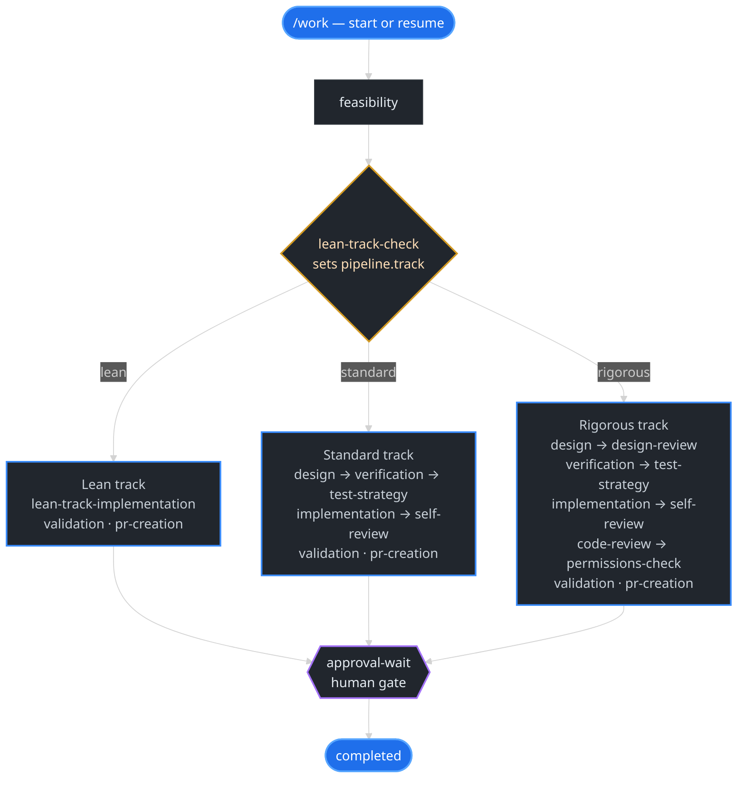

<h1 align="center">Agentic SWE</h1>

<p align="center"><strong>Claude codes your PRs. You review the receipt. Then merge.</strong></p>

<p align="center">
  <a href="https://github.com/agentic-swe/agentic-swe/actions/workflows/ci.yml"></a>
  <a href="LICENSE"></a>
  <a href="https://nodejs.org/"></a>
  <a href="CHANGELOG.md"></a>
  <a href="#subagents"></a>
  <a href="https://agentic-swe.github.io/agentic-swe-site/"></a>
</p>

An open-source autonomous SWE pipeline that runs in your editor or CI, writes every decision into your repo, and gives you a shareable audit trail of what the AI did and why.

**What you get:**

- **Structured PRs** — Claude works through a state machine (lean / standard / rigorous), not one mega-prompt
- **Cost-attributed decisions** — every phase has a dollar amount and an artifact in `.worklogs/<id>/`
- **Audit trail** — `/receipt` renders a shareable summary suitable for a PR description, Slack, or a compliance ticket

## Quickstart

```bash
npm install -g @agentic-swe/agentic-swe
claude --plugin-dir "$(agentic-swe path)"
```

Then in Claude Code:

```text
/work Add retry logic to the API client
# ...pipeline runs, opens a PR...
/receipt
```

→ See [Install & first run](#install--first-run) for Cursor, Codex, OpenCode, Gemini CLI, and Claude Code plugin marketplace alternatives.

## What `/receipt` looks like

`/receipt` reads `.worklogs/<id>/` and renders the work item as markdown. Sample from `test/fixtures/receipt/lean-happy/`:

```markdown
# /work add-retry-logic — Add retry logic to the API client

| Field | Value |
|---|---|
| Work ID | add-retry-logic |
| Track | lean |
| Status | completed |
| Duration | 47 min |
| Cost | $1.84 |
| PR | https://github.com/example/repo/pull/142 |

## Decisions made (6)

1. **feasibility → lean-track-check** ($0.08) — lean signal → feasibility.md#L1-L20
2. **lean-track-check → lean-track-implementation** ($0.04) — verdict: simple
3. **lean-track-implementation → validation** ($1.33) — implementation complete → implementation.md
4. **validation → pr-creation** ($0.21) — tests green
5. **pr-creation → approval-wait** ($0.18) — PR opened
6. **approval-wait → completed** ($0.00) — approved by suraj

## Human gates respected (1)

- `approval-wait` resolved by user at 2026-05-17T14:47:00Z — approved by suraj

## Loop counters

- `self_review_iter`: 0
- `doubt_cycles`: 1
- `code_review_iter`: 0

## Verifiable references

- All artifacts: `test/fixtures/receipt/lean-happy/`
- Audit log: `test/fixtures/receipt/lean-happy/audit.log` (9 entries)
```

Every line above is computed from `.worklogs/<id>/` — no LLM summary, no hallucinated PRs. Reproduce locally:

```bash
node scripts/render-receipt.cjs --work-dir test/fixtures/receipt/lean-happy
```

**Docs:** [agentic-swe.github.io/agentic-swe-site](https://agentic-swe.github.io/agentic-swe-site/)

---

## Pipeline at a glance

After **feasibility**, **`lean-track-check`** sets **`pipeline.track`** in **`state.json`**. Tracks merge into **PR creation** → **`approval-wait`** → **completed**.



Canonical transitions: **`state-machine.json`** and the fenced graph in **`CLAUDE.md`** (checked in CI).

---

## Install & first run

Beyond the [Quickstart](#quickstart) above, alternate paths:

**Claude Code (plugin marketplace)**

```text
/plugin marketplace add agentic-swe/agentic-swe
/plugin install agentic-swe@agentic-swe-catalog
```

**Other hosts**

| Host | How |
|------|-----|
| **Cursor** | `curl -fsSL https://raw.githubusercontent.com/agentic-swe/agentic-swe/main/scripts/install-cursor-plugin.sh \| bash` |
| **Codex** | [`.codex/INSTALL.md`](.codex/INSTALL.md) |
| **OpenCode** | [`.opencode/`](.opencode/) |
| **Gemini CLI** | `gemini-extension.json` · **`GEMINI.md`** |

After enabling the plugin, run **`/install`** once to merge **`CLAUDE.md`** and an optional **`.gitignore`** entry for **`.worklogs/`**. Maintainers see [`docs/PUBLISHING.md`](docs/PUBLISHING.md).

→ [Full installation guide](https://agentic-swe.github.io/agentic-swe-site/docs/installation) · [Golden path (~15 min)](https://agentic-swe.github.io/agentic-swe-site/docs/golden-path)

---

## Commands

| Command | Role |
|---------|------|
| `/work` | Start or resume a work item |
| `/plan-only` | Feasibility / design without implementation |
| `/brainstorm` | Design-first exploration (optional UI server) |
| `/write-plan` · `/execute-plan` | Plan bar then execution |
| `/check budget` · `/check transition` · `/check artifacts` | Enforcement before phases / transitions |
| `/subagent` | Browse / invoke specialists |
| `/repo-scan` · `/test-runner` · `/lint` | Evidence helpers |

**Full list:** [Usage](https://agentic-swe.github.io/agentic-swe-site/docs/usage) · **`commands/`**

---

## Subagents

**135+ specialists** under **`agents/subagents/`**, **auto-selected** from **`feasibility.md`** signals; manual **`/subagent invoke`** anytime. Across 10 categories — Language Specialists (29), Infrastructure (16), Quality & Security (14), Data & AI (13), Developer Experience (13), Specialized Domains (12), Business & Product (11), Core Development (10), Meta & Orchestration (10), Research & Analysis (7).

**Details:** [Subagent catalog](https://agentic-swe.github.io/agentic-swe-site/docs/subagent-catalog) · [Catalog routing](https://agentic-swe.github.io/agentic-swe-site/docs/catalog-routing)

---

## Work state

**`.worklogs/<id>/`** holds **`state.json`** (source of truth), **`progress.md`** (timeline), **`audit.log`** (append-only), and per-phase markdown (e.g. **`feasibility.md`**, **`implementation.md`**, **`validation-results.md`**, **`pr-link.txt`**).

- **State over chat** — resume from files, not from thread memory alone.
- **Evidence** — tie claims to commands, paths, or CI (`templates/evidence-standard.md`).
- **CI parity** — **`scripts/work-engine.cjs`** enforces **`/check`**-style rules.

---

## Architecture

A single **Hypervisor session** (this one) owns transitions, gates, and synthesis. Three **core agents** — **developer**, **git-operations**, **pr-manager** — carry bounded work. A **design panel** (architect, security, adversarial) reviews in parallel on the rigorous track. All consult the **135+ subagent** catalog, auto-selected from repo signals.

→ [Architecture overview](https://agentic-swe.github.io/agentic-swe-site/docs/architecture) (full diagram)

---

## Extending · CI · License

| Topic | Where |
|-------|--------|
| Extend pipeline | **`/author-pipeline`** · [`references/authoring-pipeline-capabilities.md`](references/authoring-pipeline-capabilities.md) |
| CI | [`.github/workflows/ci.yml`](.github/workflows/ci.yml) — **`npm run ci`** locally |
| Research basis | [`CLAUDE.md` — Research basis](CLAUDE.md#research-basis) |
| License | [MIT](LICENSE) · [Licensing](https://agentic-swe.github.io/agentic-swe-site/docs/licensing) |
