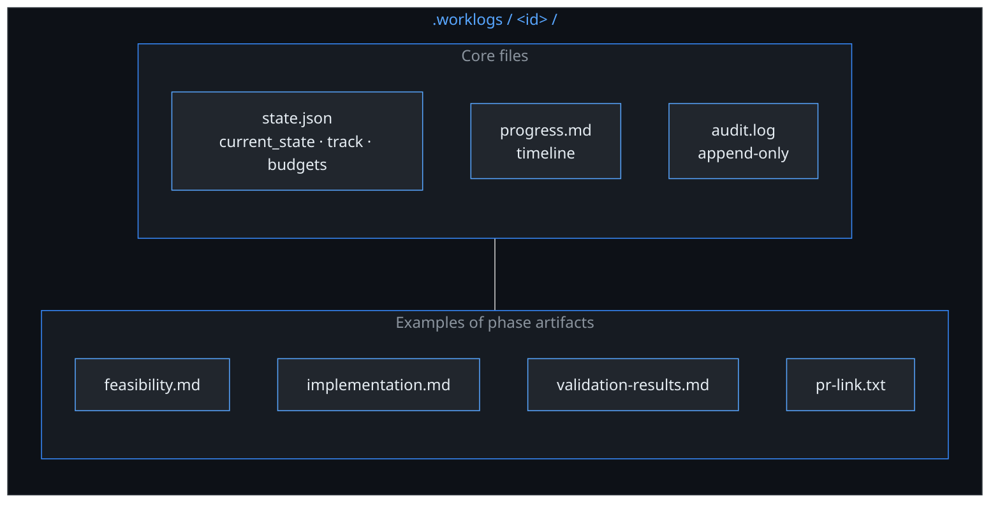
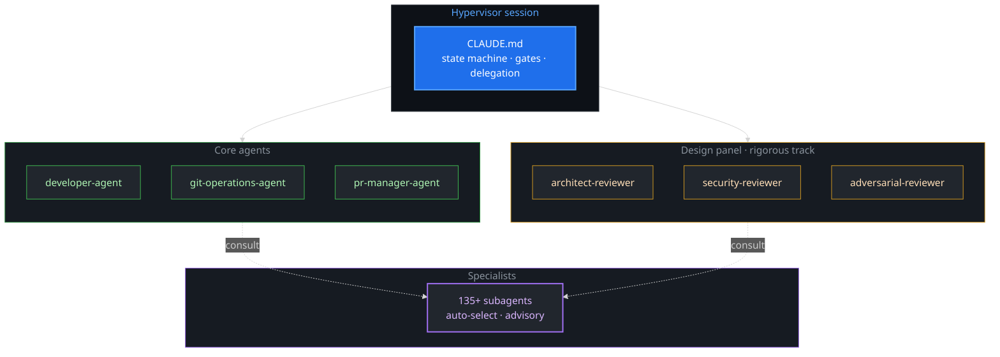

<h1 align="center">Agentic SWE</h1>

<p align="center"><strong>Hypervisor policy · Pure markdown · No cloud runtime</strong></p>

<p align="center">
  <a href="https://github.com/agentic-swe/agentic-swe/actions/workflows/ci.yml"></a>
  <a href="LICENSE"></a>
  <a href="https://nodejs.org/"></a>
  <a href="CHANGELOG.md"></a>
  <a href="#subagents"></a>
  <a href="https://agentic-swe.github.io/agentic-swe-site/"></a>
</p>

**Policy-driven autonomous engineering:** a **state-machine pipeline** (lean / standard / rigorous), **human gates**, **evidence-backed artifacts** in **`.worklogs/<id>/`**, and **135+ specialists** chosen from repo signals. Everything is **markdown in your repo** — not a hosted runner.

**Docs:** [agentic-swe.github.io/agentic-swe-site](https://agentic-swe.github.io/agentic-swe-site/)

---

## Pipeline at a glance

After **feasibility**, **`lean-track-check`** sets **`pipeline.track`** in **`state.json`**. Tracks merge into **PR creation** → **`approval-wait`** → **completed**.


Canonical transitions: **`state-machine.json`** and the fenced graph in **`CLAUDE.md`** (checked in CI).

---

## Install & first run

<details>
<summary><strong>Claude Code</strong> (recommended)</summary>

```text
/plugin marketplace add agentic-swe/agentic-swe
/plugin install agentic-swe@agentic-swe-catalog
```

Local pack: `claude --plugin-dir /path/to/agentic-swe`

```text
/work Add retry logic to the API client
```

Use **`/install`** once to merge **`CLAUDE.md`** and optional **`.gitignore`** for `.worklogs/`.

→ [Installation](https://agentic-swe.github.io/agentic-swe-site/docs/installation) · [Claude Code plugin](https://agentic-swe.github.io/agentic-swe-site/docs/claude-code-plugin)

</details>

<details>
<summary><strong>npm (pack path for any host)</strong></summary>

Install the published tarball globally (scoped package — the unscoped **`agentic-swe`** name on npm is a different project):

```bash
npm install -g @agentic-swe/agentic-swe --registry=https://registry.npmjs.org/
```

Print the pack root, then point Claude Code or scripts at it:

```bash
agentic-swe path
# claude --plugin-dir "$(agentic-swe path)"
```

Maintainers: **`docs/PUBLISHING.md`** — **First time on npm:** create the **`@agentic-swe`** organization on the registry before **`npm publish`** ([details](docs/PUBLISHING.md#first-time-on-npm-create-the-scope)).

</details>

<details>
<summary><strong>Cursor</strong></summary>

```bash
curl -fsSL https://raw.githubusercontent.com/agentic-swe/agentic-swe/main/scripts/install-cursor-plugin.sh | bash
```

From an **npm** global install, symlink the pack into Cursor’s local plugins dir:

```bash
export AGENTIC_SWE_PACK_ROOT="$(agentic-swe path)"
curl -fsSL https://raw.githubusercontent.com/agentic-swe/agentic-swe/main/scripts/install-cursor-plugin.sh | bash
```

Optional: `AGENTIC_SWE_TARGET_REPO=/path/to/app` on the same line (needs **Node**) to merge **`CLAUDE.md`**.

→ [Cursor plugin](https://agentic-swe.github.io/agentic-swe-site/docs/cursor-plugin)

</details>

<details>
<summary><strong>Codex · OpenCode · Gemini CLI</strong></summary>

| Host | Pointer |
|------|---------|
| **Codex** | [`.codex/INSTALL.md`](.codex/INSTALL.md) · [Codex doc (site repo)](https://github.com/agentic-swe/agentic-swe-site/blob/main/src/content/docs/README.codex.md) |
| **OpenCode** | [`.opencode/`](.opencode/) · [OpenCode doc (site repo)](https://github.com/agentic-swe/agentic-swe-site/blob/main/src/content/docs/README.opencode.md) |
| **Gemini CLI** | `gemini-extension.json` · **`GEMINI.md`** |

</details>

**~15 minutes:** [Golden path](https://agentic-swe.github.io/agentic-swe-site/docs/golden-path)

---

## Commands

| Command | Role |
|---------|------|
| `/work` | Start or resume a work item |
| `/plan-only` | Feasibility / design without implementation |
| `/brainstorm` | Design-first exploration (optional UI server) |
| `/write-plan` · `/execute-plan` | Plan bar then execution |
| `/check budget` · `/check transition` · `/check artifacts` | Enforcement before phases / transitions |
| `/subagent` | Browse / invoke specialists |
| `/repo-scan` · `/test-runner` · `/lint` | Evidence helpers |

**Full list:** [Usage](https://agentic-swe.github.io/agentic-swe-site/docs/usage) · **`commands/`**

---

## Subagents

Under **`agents/subagents/`**. **Auto-selected** from **`feasibility.md`** signals; manual **`/subagent invoke`** anytime.

| Category | Count |
|----------|------:|
| Language Specialists | 29 |
| Infrastructure | 16 |
| Quality & Security | 14 |
| Data & AI | 13 |
| Developer Experience | 13 |
| Specialized Domains | 12 |
| Business & Product | 11 |
| Core Development | 10 |
| Meta & Orchestration | 10 |
| Research & Analysis | 7 |

**Details:** [Subagent catalog](https://agentic-swe.github.io/agentic-swe-site/docs/subagent-catalog) · [Catalog routing](https://agentic-swe.github.io/agentic-swe-site/docs/catalog-routing)

---

## Work state & principles

**`.worklogs/<id>/`** holds **`state.json`** (source of truth), **`progress.md`**, **`audit.log`**, and phase markdown files.



- **State over chat** — resume from files, not from thread memory alone.
- **Evidence** — tie claims to commands, paths, or CI (`templates/evidence-standard.md`).
- **CI parity** — **`scripts/work-engine.cjs`** can enforce **`/check`**-style rules.

---

## Repository layout

```
agentic-swe/
├── commands/ phases/ agents/ templates/ references/
├── scripts/          # work-engine, catalog, memory, dashboard, …
├── hooks/ config/ schemas/
├── state-machine.json
├── CLAUDE.md         # Hypervisor policy (canonical with state-machine.json)
├── AGENTS.md GEMINI.md
└── test/
```

---

## Architecture



---

## Extending · CI · License

| Topic | Where |
|-------|--------|
| Extend pipeline | **`/author-pipeline`** · [`references/authoring-pipeline-capabilities.md`](references/authoring-pipeline-capabilities.md) |
| CI | [`.github/workflows/ci.yml`](.github/workflows/ci.yml) — **`npm run ci`** locally |
| Research basis | [`CLAUDE.md` — Research basis](CLAUDE.md#research-basis) |
| License | [MIT](LICENSE) · [Licensing](https://agentic-swe.github.io/agentic-swe-site/docs/licensing) |
