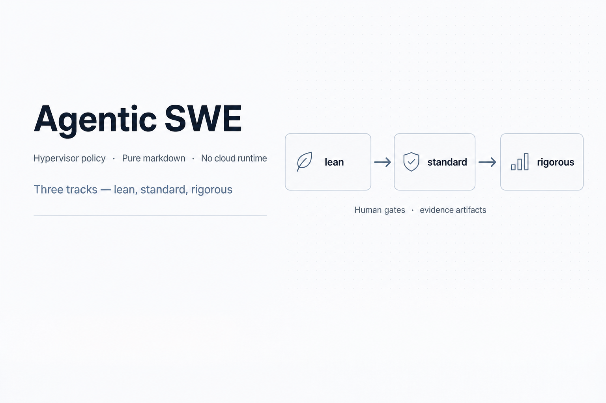
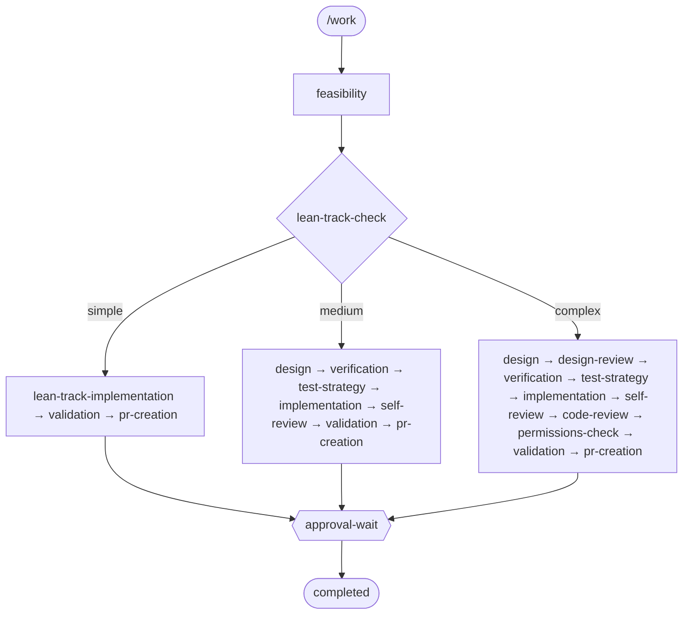
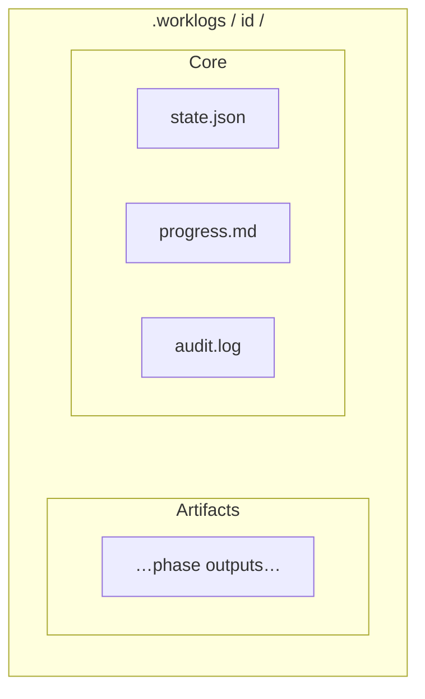

<p align="center">
  
</p>

<h1 align="center">Agentic SWE</h1>

<p align="center">
  <a href="https://github.com/agentic-swe/agentic-swe/actions/workflows/ci.yml"></a>
  <a href="LICENSE"></a>
  <a href="https://nodejs.org/"></a>
  <a href="CHANGELOG.md"></a>
  <a href="#subagents"></a>
  <a href="https://agentic-swe.github.io/agentic-swe-site/"></a>
</p>

**Policy-driven autonomous engineering** for AI coding tools: a **state-machine pipeline** (lean / standard / rigorous tracks), **human gates**, **evidence-backed artifacts** under `.worklogs/<id>/`, and **135+ specialists** auto-selected from your repo signals. **Markdown in your repo** — not a hosted runner.

**Full guide (install, tracks, commands, troubleshooting):** [agentic-swe.github.io/agentic-swe-site](https://agentic-swe.github.io/agentic-swe-site/)

---

## Pipeline at a glance

After feasibility, **`lean-track-check`** sets **`pipeline.track`** in **`state.json`**. All three tracks converge on **PR creation**, then **`approval-wait`** (human gate), then **completed**.



Canonical edges: **`state-machine.json`** and the fenced graph in root **`CLAUDE.md`** (verified in CI).

---

## Install & first run

<details>
<summary><strong>Claude Code</strong> (recommended)</summary>

```text
/plugin marketplace add agentic-swe/agentic-swe
/plugin install agentic-swe@agentic-swe-catalog
```

Local pack: `claude --plugin-dir /path/to/agentic-swe`

```text
/work Add retry logic to the API client
```

Use **`/install`** once to merge **`CLAUDE.md`** and optional **`.gitignore`** for `.worklogs/`.

→ [Installation](https://agentic-swe.github.io/agentic-swe-site/docs/installation) · [Claude Code plugin](https://agentic-swe.github.io/agentic-swe-site/docs/claude-code-plugin)

</details>

<details>
<summary><strong>Cursor</strong></summary>

```bash
curl -fsSL https://raw.githubusercontent.com/agentic-swe/agentic-swe/main/scripts/install-cursor-plugin.sh | bash
```

Optional: `AGENTIC_SWE_TARGET_REPO=/path/to/app` on the same line (needs **Node**) to merge **`CLAUDE.md`**.

→ [Cursor plugin](https://agentic-swe.github.io/agentic-swe-site/docs/cursor-plugin)

</details>

<details>
<summary><strong>Codex · OpenCode · Gemini CLI</strong></summary>

| Host | Pointer |
|------|---------|
| **Codex** | [`.codex/INSTALL.md`](.codex/INSTALL.md) · [Codex doc (site repo)](https://github.com/agentic-swe/agentic-swe-site/blob/main/src/content/docs/README.codex.md) |
| **OpenCode** | [`.opencode/`](.opencode/) · [OpenCode doc (site repo)](https://github.com/agentic-swe/agentic-swe-site/blob/main/src/content/docs/README.opencode.md) |
| **Gemini CLI** | `gemini-extension.json` · **`GEMINI.md`** |

</details>

**~15 minute path:** [Golden path](https://agentic-swe.github.io/agentic-swe-site/docs/golden-path) (install → `/work` → `.worklogs/` → approval gate).

---

## Commands

| Command | Role |
|---------|------|
| `/work` | Start or resume a work item |
| `/plan-only` | Feasibility / design without implementation |
| `/brainstorm` | Design-first exploration (optional UI server) |
| `/write-plan` · `/execute-plan` | Plan bar then execution |
| `/check budget` · `/check transition` · `/check artifacts` | Enforcement skills before phases / transitions |
| `/subagent` | Browse / invoke specialists |
| `/repo-scan` · `/test-runner` · `/lint` | Evidence helpers |

**Complete list:** [Usage](https://agentic-swe.github.io/agentic-swe-site/docs/usage) · **`commands/`** in this repo.

---

## Subagents

Specialists live under **`agents/subagents/`**. The pipeline **auto-selects** from signals in **`feasibility.md`**; you can still **`/subagent invoke`** manually.

| Category | Count |
|----------|------:|
| Language Specialists | 29 |
| Infrastructure | 16 |
| Quality & Security | 14 |
| Data & AI | 13 |
| Developer Experience | 13 |
| Specialized Domains | 12 |
| Business & Product | 11 |
| Core Development | 10 |
| Meta & Orchestration | 10 |
| Research & Analysis | 7 |

**Models, descriptions, routing:** [Subagent catalog](https://agentic-swe.github.io/agentic-swe-site/docs/subagent-catalog) · [Catalog routing](https://agentic-swe.github.io/agentic-swe-site/docs/catalog-routing).

---

## Work state & principles

Per-item state lives in **`.worklogs/<id>/`**. **`state.json`** is authoritative; **`progress.md`** and **`audit.log`** are the human and trace trails; phases write markdown artifacts (e.g. **`feasibility.md`**, **`validation-results.md`**, **`pr-link.txt`**).



- **State over chat** — resume and automate from files, not thread memory.
- **Evidence** — artifacts tie claims to commands, files, or CI output (`templates/evidence-standard.md`).
- **Budgets & CI** — optional **`scripts/work-engine.cjs`** mirrors **`/check`** rules for automation.

---

## Repository layout

```
agentic-swe/
├── commands/ phases/ agents/ templates/ references/
├── scripts/          # work-engine, catalog, memory, dashboard, …
├── hooks/ config/ schemas/
├── state-machine.json
├── CLAUDE.md         # Hypervisor policy (canonical with state-machine.json)
├── AGENTS.md GEMINI.md
└── test/
```

---

## Architecture

<p align="center">
  
</p>

The **Hypervisor** session applies **`CLAUDE.md`**, owns transitions and gates, and delegates to **core agents** (implementation, git, PR). **Design panel** reviewers run on rigorous paths; **subagents** advise implementation and reviews when signals warrant it.

---

## Extending · CI · License

| Topic | Where |
|-------|--------|
| Add phase / agent / command | **`/author-pipeline`** · [`references/authoring-pipeline-capabilities.md`](references/authoring-pipeline-capabilities.md) |
| CI | [`.github/workflows/ci.yml`](.github/workflows/ci.yml) — locally **`npm run ci`** |
| Research basis | [`CLAUDE.md` — Research basis](CLAUDE.md#research-basis) |
| License | [MIT](LICENSE) · [Licensing (site)](https://agentic-swe.github.io/agentic-swe-site/docs/licensing) |
