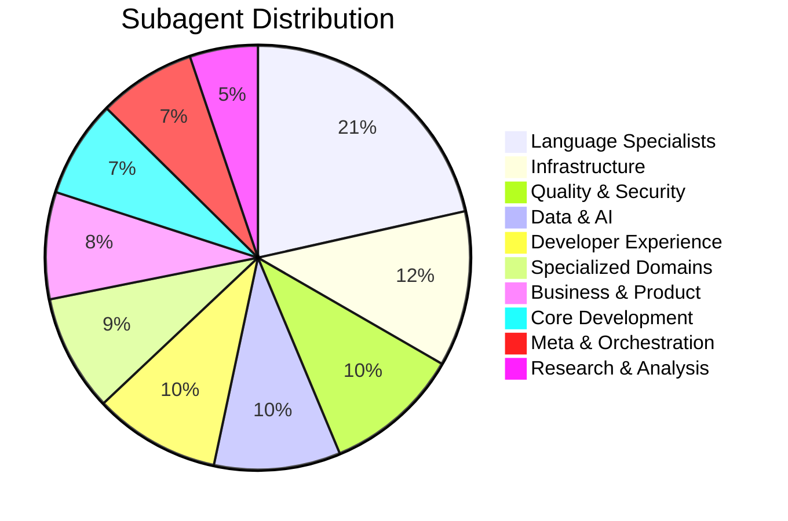
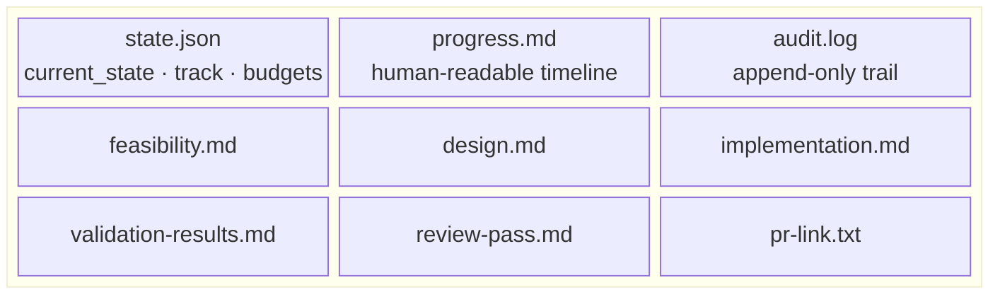
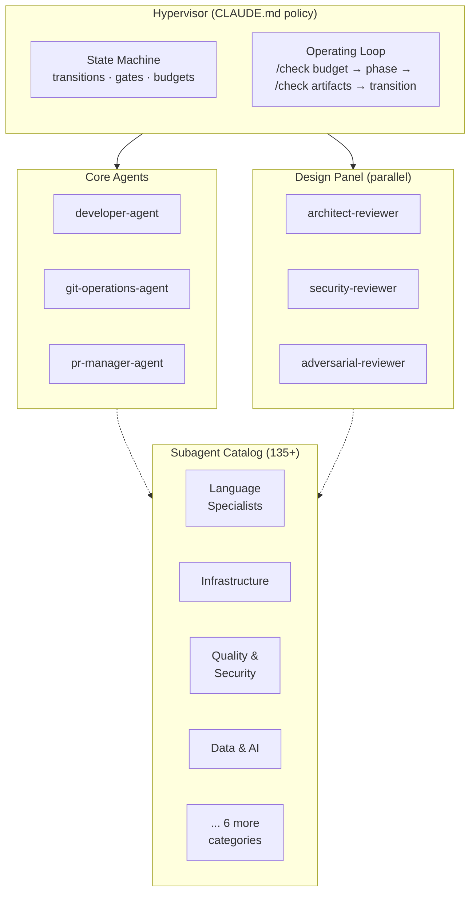

# Agentic SWE

[](https://github.com/agentic-swe/agentic-swe/actions/workflows/ci.yml)
[](LICENSE)
[](https://nodejs.org/)
[](CHANGELOG.md)
[](#subagent-catalog)
[](https://agentic-swe.github.io/agentic-swe-site/)

An autonomous software engineering pipeline — 135+ specialized agents, governed by a state machine, running inside your AI coding IDE.

```mermaid
flowchart TD
    start["/work &#34;your task&#34;"] --> feasibility["Feasibility Analysis"]
    feasibility --> trackCheck{"Track Check"}

    trackCheck -- "simple" --> lean["<b>LEAN TRACK</b><br/>implement + review<br/>validate<br/>PR"]
    trackCheck -- "medium" --> standard["<b>STANDARD TRACK</b><br/>design → verification<br/>test-strategy → implementation<br/>self-review → validate → PR"]
    trackCheck -- "complex" --> rigorous["<b>RIGOROUS TRACK</b><br/>design → design-review (panel)<br/>verification → test-strategy<br/>implementation → self-review<br/>code-review → permissions-check<br/>validate → PR"]

    lean --> approval
    standard --> approval
    rigorous --> approval

    approval{{"🛑 approval-wait<br/>(human gate)"}}
    approval -- "approved" --> done(["completed ✓"])
    approval -- "changes requested" --> rework["Back to implementation"]
```



---

## Commands

| Goal | Command | Principle |
|------|---------|-----------|
| Start or resume a task | `/work <task or id>` | One command drives the full lifecycle |
| Design without coding | `/plan-only <task>` | Feasibility and design only — stop before implementation |
| Explore before committing | `/brainstorm` | Design-first thinking with optional visual server |
| Refine the plan | `/write-plan` | Raise plan quality without touching code |
| Execute the plan | `/execute-plan` | Run implementation from the approved plan |
| Browse specialists | `/subagent` | Discover and invoke any of 135+ domain agents |
| Verify budgets | `/check budget` | Enforce iteration and cost limits before each phase |
| Inspect health | `/evaluate-work <id>` | Audit a work item's state, counters, and artifacts |
| Snapshot the codebase | `/repo-scan` | Structured repo context for feasibility analysis |
| Extend the pipeline | `/author-pipeline` | Safe checklist for adding phases, agents, commands |

Full reference: [Usage docs](https://agentic-swe.github.io/agentic-swe-site/docs/usage)

---

## Quick Start

<details>
<summary><strong>Claude Code</strong> (primary platform)</summary>

**Marketplace install:**

```text
/plugin marketplace add agentic-swe/agentic-swe
/plugin install agentic-swe@agentic-swe-catalog
```

**Local development:**

```bash
git clone https://github.com/agentic-swe/agentic-swe.git
claude --plugin-dir /path/to/agentic-swe
```

Then open your project and run:

```text
/work Add retry logic to the API client
```

Per-work state lives in `.worklogs/<id>/` inside your project. Run `/install` on first use to merge `CLAUDE.md` and set up `.gitignore` for worklogs.

Guide: [Claude Code plugin](https://agentic-swe.github.io/agentic-swe-site/docs/claude-code-plugin) · [Installation](https://agentic-swe.github.io/agentic-swe-site/docs/installation)

</details>

<details>
<summary><strong>Cursor</strong></summary>

```bash
curl -fsSL https://raw.githubusercontent.com/agentic-swe/agentic-swe/main/scripts/install-cursor-plugin.sh | bash
```

Add `AGENTIC_SWE_TARGET_REPO=/path/to/app` on the same line to auto-merge `CLAUDE.md` into your project (requires `node`). Reload after install.

Guide: [Cursor plugin](https://agentic-swe.github.io/agentic-swe-site/docs/cursor-plugin)

</details>

<details>
<summary><strong>Codex</strong></summary>

Clone this repo and follow `.codex/INSTALL.md` to symlink or copy the pack into your project.

Guide: [Codex setup](https://github.com/agentic-swe/agentic-swe-site/blob/main/src/content/docs/README.codex.md)

</details>

<details>
<summary><strong>OpenCode</strong></summary>

ESM plugin under `.opencode/` injects orchestration policy.

Guide: [OpenCode setup](https://github.com/agentic-swe/agentic-swe-site/blob/main/src/content/docs/README.opencode.md)

</details>

<details>
<summary><strong>Gemini CLI</strong></summary>

Uses `gemini-extension.json` for native extension loading. Context provided via `GEMINI.md`.

</details>

**First success in ~15 minutes:** follow the [Golden path](https://agentic-swe.github.io/agentic-swe-site/docs/golden-path) (install → `/work` → `.worklogs/` → approval gate).

---

## Subagent Catalog

135+ agents across 10 categories — auto-selected during pipeline execution based on detected languages, frameworks, and domains. Agents delegate to other agents when they need deeper expertise.



| Category | Agents | Typical use |
|----------|--------|-------------|
| **Core Development** | `api-designer` · `backend-developer` · `fullstack-developer` + 7 more | Feature architecture and cross-layer implementation |
| **Language Specialists** | `typescript-pro` · `python-pro` · `rust-engineer` · `golang-pro` + 25 more | Idiomatic patterns, performance, and deep language expertise |
| **Infrastructure** | `kubernetes-specialist` · `terraform-engineer` · `docker-expert` + 13 more | Cloud, containers, IaC, and deployment pipelines |
| **Quality & Security** | `code-reviewer` · `security-auditor` · `penetration-tester` + 11 more | Audits, vulnerability scanning, and review automation |
| **Data & AI** | `llm-architect` · `ml-engineer` · `data-engineer` + 10 more | ML systems, data pipelines, and LLM integrations |
| **Developer Experience** | `refactoring-specialist` · `mcp-developer` · `cli-developer` + 10 more | Tooling, DX, documentation, and workflow improvements |
| **Specialized Domains** | `fintech-engineer` · `blockchain-developer` · `iot-engineer` + 9 more | Regulated industries and niche stacks |
| **Business & Product** | `product-manager` · `technical-writer` · `ux-researcher` + 8 more | Strategy, user research, and communication |
| **Meta & Orchestration** | `multi-agent-coordinator` · `workflow-orchestrator` + 8 more | Multi-agent coordination and context management |
| **Research & Analysis** | `competitive-analyst` · `trend-analyst` · `research-analyst` + 4 more | Market intelligence and research synthesis |

Full catalog with models and descriptions: [Subagent catalog](https://agentic-swe.github.io/agentic-swe-site/docs/subagent-catalog)

Manual invocation:

```text
/subagent invoke rust-engineer Fix the lifetime issues in src/parser/mod.rs
```

---

## How It Works

The pipeline is a **governed state machine** — not free-form prompting. Every task moves through explicit phases with evidence gates, budget controls, and human checkpoints.



> Every phase writes artifacts here. `state.json` is the single source of truth — the pipeline never infers progress from chat history.

**Design principles:**

| Principle | What it means |
|-----------|---------------|
| **State over memory** | `state.json` tracks progress, not chat context. Resume anytime, from any session. |
| **Evidence over narrative** | Phase artifacts cite repo output, commands, and files. "Seems right" is never sufficient. |
| **Budget-aware execution** | Iteration caps, cost tracking, and stall detection prevent runaway loops. The work engine enforces the same rules in CI. |
| **Human gates at high-stakes moments** | Ambiguity stops work; PRs require explicit approval; failures escalate rather than retry silently. |

---

## Project Structure

```
agentic-swe/
├── commands/           # Slash command definitions (/work, /check, /brainstorm, …)
├── phases/             # Phase prompts (one .md per pipeline state)
├── agents/
│   ├── developer-agent.md
│   ├── git-operations-agent.md
│   ├── pr-manager-agent.md
│   ├── panel/          # Parallel design reviewers (architect, security, adversarial)
│   ├── subagents/      # 135+ specialists across 10 categories
│   └── plugin-runtime/ # Bundled helpers (brainstorm server, catalog shell)
├── templates/          # state.json, progress.md, evidence-standard.md, …
├── references/         # Readonly tool/process references
├── scripts/            # Work engine, catalog router, memory index, dashboard
├── config/             # Default budget thresholds, memory config
├── hooks/              # Session lifecycle hooks (Claude Code + Cursor)
├── state-machine.json  # Canonical transition graph
├── CLAUDE.md           # Hypervisor policy (state machine + operating loop)
├── AGENTS.md           # Codex/platform compatibility shim
├── GEMINI.md           # Gemini CLI context
└── test/               # Unit, integration, smoke, and LLM test harness
```

---

## Architecture



---

## Why Agentic SWE?

AI coding agents default to the fastest path — which usually means skipping feasibility checks, design thinking, self-review, and the kind of structured governance that makes changes safe to merge. Agentic SWE turns your AI IDE session into a disciplined pipeline where every task is analyzed, routed to an appropriate track, executed with specialist agents, and verified before a human sees the PR.

This is not a hosted cloud service or async runner. It is a **markdown workflow pack** that runs locally in your IDE session — you keep full control, full visibility into `.worklogs/`, and can resume, inspect, or override at any point.

---

## Extending

| Goal | How |
|------|-----|
| Add a subagent | Create `.md` in `agents/subagents/<category>/` with frontmatter |
| Add a pipeline phase | Create `.md` in `phases/`, update `CLAUDE.md` and `state-machine.json` |
| Adjust budgets | Edit `config/budget-thresholds.default.json` or per-repo override |
| Inspect work items | `npm run summarize-work` or `/evaluate-work <id>` |
| Local dashboard | `npm run swe-dashboard -- --cwd /path/to/repo` |
| Migrate state after upgrades | `node scripts/migrate-work-state.js --apply` |

---

## CI

[`.github/workflows/ci.yml`](.github/workflows/ci.yml) runs on push/PR to `main`, merge queue, and manual dispatch. Matrix: Node 20 + 22. Steps: `npm run verify` → `npm run version:check` → `npm test`.

Run locally: `npm run ci`

---

## Research Basis

Built on ideas from SWE-agent, Agentless, Ambig-SWE, Reflexion, Self-Refine, AgentCoder, TALE, and OpenHands. See the [Research Basis](CLAUDE.md#research-basis) section in `CLAUDE.md` for the full citation table.

---

## License

[MIT](LICENSE) · [Licensing details](https://agentic-swe.github.io/agentic-swe-site/docs/licensing)
